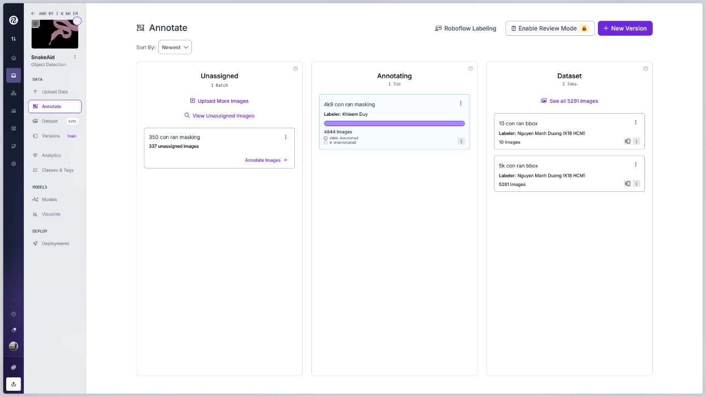
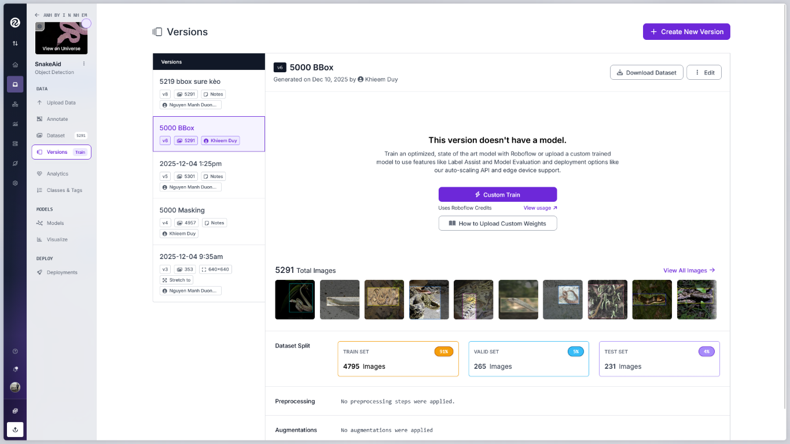
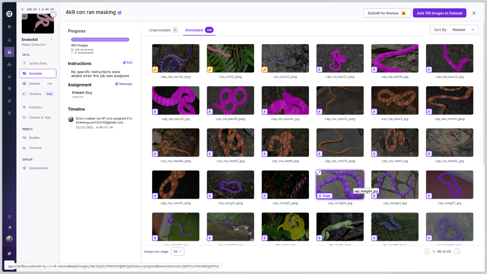
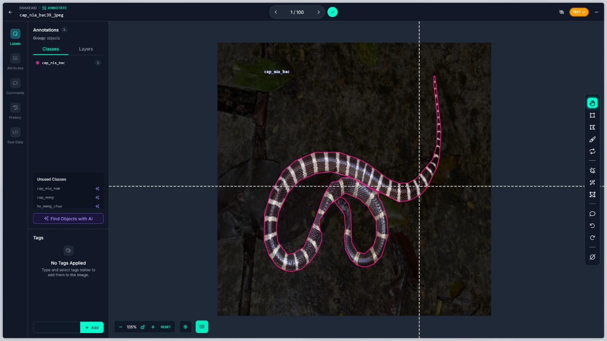
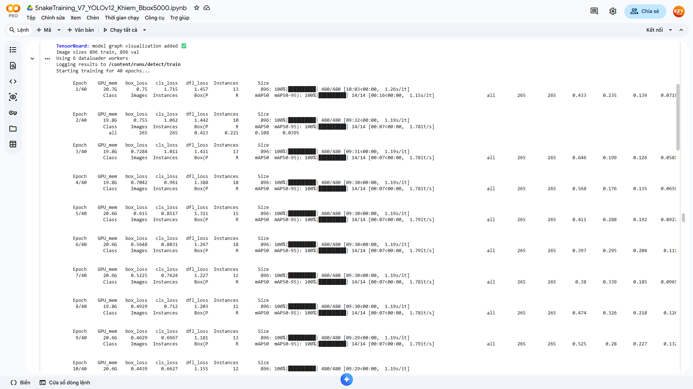
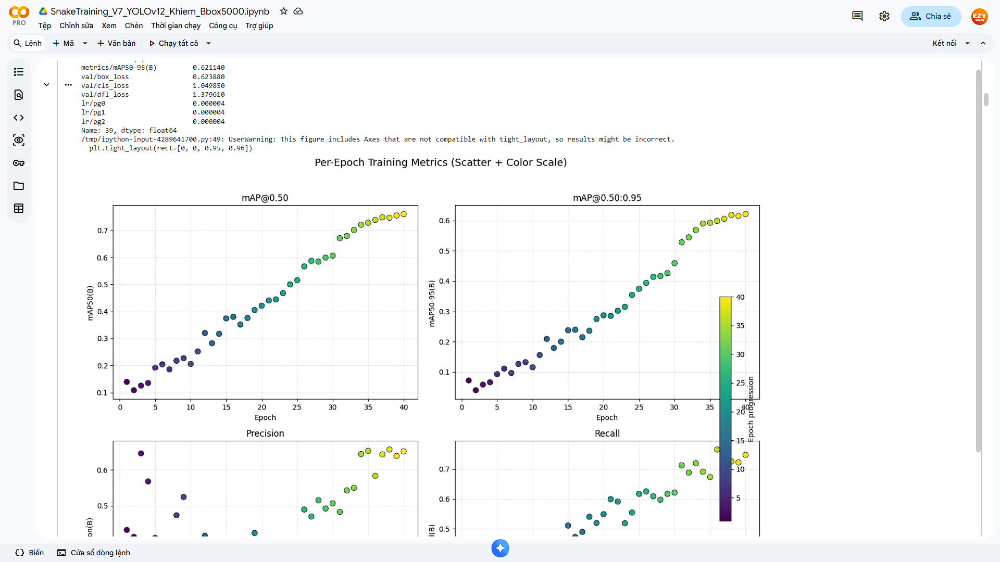
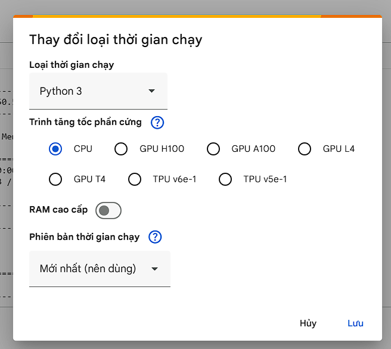
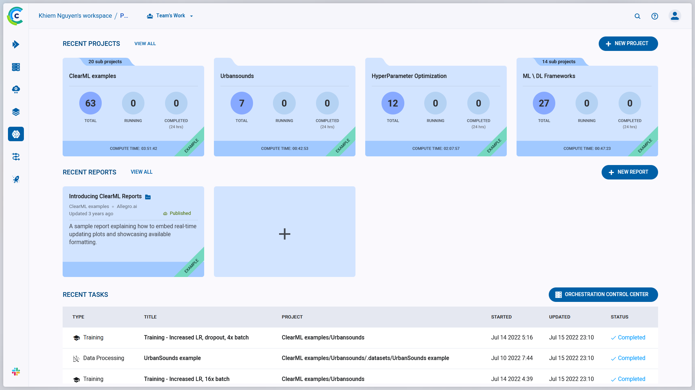
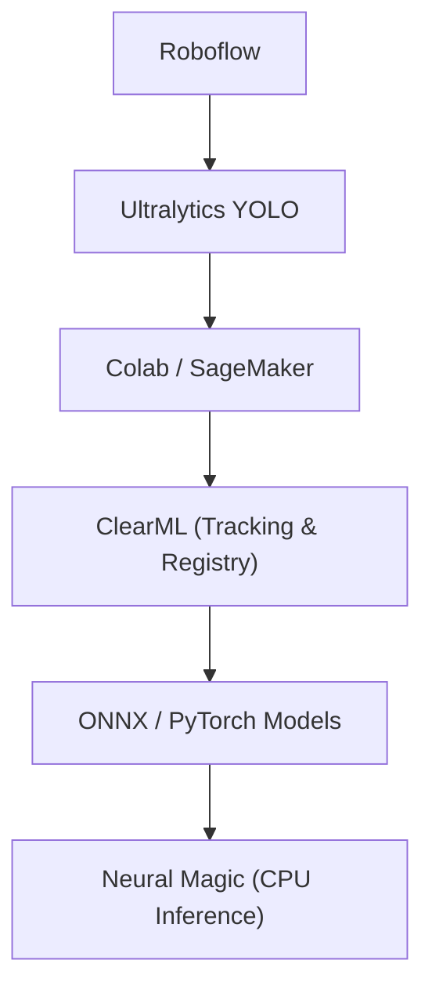

# SnakeAid ComputerVision AI Model Training


# Tech Stack Overview

This repository focuses on the **training side of the SnakeAid Computer Vision AI system**, covering data preparation, model training, experiment tracking, and deployment-oriented model packaging.

The tech stack is organized following a **practical AI / MLOps pipeline**, from data labeling to production-ready models.

---

## Data Labeling & Dataset Management

### **Roboflow**

<table style="border-collapse: collapse; width: 100%;">
  <tr>
    <td style="border: none; text-align: center;"><br><small>Annote Manage</small></td>
    <td style="border: none; text-align: center;"><br><small>Data Versioning</small></td>
  </tr>
  <tr>
    <td style="border: none; text-align: center;"><br><small>Anotating</small></td>
    <td style="border: none; text-align: center;"><br><small>Labeling</small></td>
  </tr>
</table>

Roboflow is used for:

* Image annotation (Bounding Box / Segmentation)
* Dataset versioning
* Exporting datasets in **YOLO-compatible format**

Roboflow helps standardize raw image data into structured datasets suitable for training YOLO models, while maintaining consistency across dataset versions.

> **Role in pipeline:** Data preparation & labeling

---

## Model Training Framework

### **Ultralytics YOLO**

Ultralytics YOLO is the core computer vision framework used for:

* Object detection and segmentation
* Model architecture definition
* Training, validation, and evaluation workflows

YOLO is chosen due to its balance between:

* Real-time performance
* Accuracy
* Deployment flexibility (CPU / GPU / ONNX export)

> **Role in pipeline:** Model architecture & training logic

---

## Training Environments

### **Google Colab**

<table style="border-collapse: collapse; width: 100%;">
  <tr>
    <td style="border: none; text-align: center;"><br><small>Training</small></td>
    <td style="border: none; text-align: center;"><br><small>Evaluate</small></td>
  </tr>
  <tr>
    <td style="border: none; text-align: center;"><br><small>ColabPro</small></td>
    <td style="border: none; text-align: center;"><br><small>Runtimes</small></td>
  </tr>
</table>

Google Colab serves as the **primary training environment**, providing:

* Easy access to GPU resources
* Rapid experimentation via notebooks
* Fast iteration during model development

Colab is mainly used for:

* Initial experiments
* Hyperparameter tuning
* Dataset validation

> **Role in pipeline:** Main training platform

---

### **Amazon SageMaker (Experimental / Study)**

Amazon SageMaker is used as a **secondary training platform** for:

* Studying managed ML workflows
* Comparing notebook-based training with cloud-managed training services
* Understanding production-grade ML infrastructure concepts

SageMaker usage in this project is **experimental and educational**, not the primary training path.

> **Role in pipeline:** Training workflow comparison & experimentation

---

## MLOps & Experiment Management

### **ClearML**

ClearML acts as the **central MLOps backbone** of the project.

It is used for:

* Experiment tracking (metrics, parameters, system info)
* Model versioning and registry
* Artifact management (models, logs, results)
* Ensuring reproducibility across training runs

ClearML replaces ad-hoc storage solutions (e.g. Google Drive) as the **single source of truth** for trained models.

> **Role in pipeline:** Experiment tracking, model registry, and reproducibility

---

## Model Packaging & Inference Optimization (Optional)

### **Neural Magic (DeepSparse)**

Neural Magic (DeepSparse) is explored as an **optional inference optimization layer** for:

* CPU-based deployments
* ONNX model acceleration
* Cost-efficient inference on x86 CPU environments

Neural Magic is **not required** for training, but is studied to evaluate:

* CPU inference performance
* Cost vs latency trade-offs in production environments

> **Role in pipeline:** CPU inference optimization (optional)

---

## 🔗 Tech Stack Summary (Pipeline View)


# Session 2 — Essential AI Norms

This session explains the **essential AI and training concepts** that appear *directly in the training configuration, logs, and output artifacts* of this repository.

The goal is **not to teach AI theory**, but to help readers:
- understand what actually happened during training,
- read YOLO training logs without confusion,
- interpret common output files generated after training.

No prior deep AI knowledge is assumed.

---

## 1. Training Configuration — What the Model Was Asked to Do

### Epochs
```python
epochs=120
```

An **epoch** means one full pass over the entire training dataset.

Training for 120 epochs means the model is allowed to learn from the same data repeatedly, gradually improving its internal parameters.
However, training does **not necessarily reach epoch 120** if early stopping is triggered.

---

### Batch Size

```python
batch=32
```

The **batch size** defines how many images are processed together before the model updates its weights.

* Larger batches provide more stable learning.
* Smaller batches reduce GPU memory usage.

---

### Image Size

```python
imgsz=640
```

YOLO models do not train on raw image sizes.
All images are resized to a fixed resolution to:

* allow batch processing,
* fit the CNN architecture,
* optimize GPU computation.

---

## 2. Optimization — How the Model Learns

### Optimizer: AdamW

```python
optimizer="AdamW"
```

The **optimizer** controls how the model updates its parameters.

AdamW is chosen because it:

* converges faster than classical SGD,
* handles noisy gradients well,
* is commonly used in modern object detection tasks.

---

### Learning Rate Strategy

```python
lr0=0.002
lrf=0.01
cos_lr=True
warmup_epochs=3
```

The **learning rate** defines how aggressively the model updates its weights.

* `cos_lr=True` enables cosine decay, meaning:

  * learning is stronger at the beginning,
  * becomes more conservative near the end.
* `warmup_epochs=3` prevents unstable updates during the first epochs.

---

### Early Stopping

```python
patience=15
```

Early stopping automatically terminates training if the validation metric does not improve for 15 consecutive epochs.

This:

* prevents overfitting,
* saves GPU time,
* avoids unnecessary training cycles.

---

## 3. Data Augmentation — Why the Model Sees Modified Images

The training configuration includes multiple augmentation techniques:

```python
hsv_h, hsv_s, hsv_v
degrees, translate, scale, shear
mosaic, mixup, copy_paste
```

These augmentations help the model generalize to real-world conditions instead of memorizing the training data.

---

### Mosaic Augmentation

```python
mosaic=1.0
close_mosaic=10
```

Mosaic combines four images into one during training.

Benefits:

* increases object density per image,
* improves detection of small objects,
* enhances robustness.

Mosaic is disabled during the final epochs (`close_mosaic=10`) to allow fine-tuning on natural images.

**Related output visualization:**

<table style="border-collapse: collapse; width: 100%;">
  <tr>
    <td style="border: none; text-align: center;"><br><small>train_batch0</small></td>
    <td style="border: none; text-align: center;"><br><small>train_batch1</small></td>
  </tr>
  <tr>
    <td colspan="2" style="border: none; text-align: center;"><br><small>train_batch2</small></td>
  </tr>
</table>

---

### MixUp & Copy-Paste

```python
mixup=0.10
copy_paste=0.10
```

These techniques blend objects or images together to:

* reduce overfitting,
* expose the model to complex backgrounds,
* simulate rare scenarios.

They are applied conservatively to avoid confusing the model.

---

## 4. Model Architecture — Understanding the Scale of the Network

From the training log:

```text
231 layers
20,069,970 parameters
68.3 GFLOPs
```

* **Parameters (~20M)** represent the model's capacity to learn patterns.
* **GFLOPs** measure the computational cost of a single inference.

These numbers directly influence:

* inference speed,
* deployment cost,
* feasibility on CPU vs GPU environments.

---

## 5. Evaluation Metrics — What the Numbers Mean

From validation logs:

```text
Box(P)   R   mAP50   mAP50-95
```

### Precision (P)

Among all predicted bounding boxes, how many are correct?

### Recall (R)

Among all real objects, how many did the model successfully detect?

---

### mAP50 vs mAP50-95

* **mAP50** evaluates detection quality at a loose overlap threshold.
* **mAP50-95** averages performance over stricter thresholds.

A lower mAP50-95 does **not** imply poor performance — it reflects a harder evaluation standard.

**Related curves:**

<table style="border-collapse: collapse; width: 100%;">
  <tr>
    <td style="border: none; text-align: center;"></td>
    <td style="border: none; text-align: center;"></td>
  </tr>
  <tr>
    <td style="border: none; text-align: center;"></td>
    <td style="border: none; text-align: center;"></td>
  </tr>
</table>

---

## 6. Output Artifacts — Understanding Training Results

YOLO training generates multiple artifacts that help interpret model behavior.

### Confusion Matrix

<table style="border-collapse: collapse; width: 100%;">
  <tr>
    <td style="border: none; text-align: center;"><br><small>confusion_matrix</small></td>
    <td style="border: none; text-align: center;"><br><small>confusion_matrix_normalized</small></td>
  </tr>
</table>

Shows which classes the model confuses with each other and highlights class imbalance or systematic errors.

---

### Training Curves


Visualize:
* loss convergence,
* metric stability,
* training vs validation trends.

---

### Dataset Statistics

<table style="border-collapse: collapse; width: 100%;">
  <tr>
    <td style="border: none; text-align: center;"></td>
    <td style="border: none; text-align: center;"></td>
  </tr>
</table>

Reveal:
* class distribution,
* correlation between bounding box dimensions,
* potential dataset imbalance.

---

### Prediction Visualization

<table style="border-collapse: collapse; width: 100%;">
  <tr>
    <td style="border: none; text-align: center;"><br><small>val_batch0_labels</small></td>
    <td style="border: none; text-align: center;"><br><small>val_batch0_pred</small></td>
  </tr>
  <tr>
    <td style="border: none; text-align: center;"><br><small>val_batch1_labels</small></td>
    <td style="border: none; text-align: center;"><br><small>val_batch1_pred</small></td>
  </tr>
  <tr>
    <td style="border: none; text-align: center;"><br><small>val_batch2_labels</small></td>
    <td style="border: none; text-align: center;"><br><small>val_batch2_pred</small></td>
  </tr>
</table>

These images compare:

* ground-truth annotations,
* model predictions,
  allowing qualitative error analysis.

---

## 7. Why This Session Matters

This session focuses on **reading and understanding training outputs**, not on abstract AI theory.

By grounding explanations in:

* actual training logs,
* configuration parameters,
* generated artifacts,

readers can build intuition about:

* how models learn,
* why metrics behave as they do,
* how training decisions affect real outcomes.