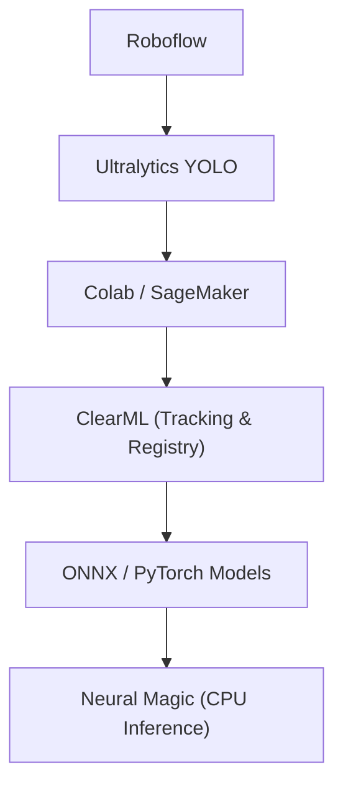

# SnakeAid ComputerVision AI Model Training

# Tech Stack Overview

This repository focuses on the **training side of the SnakeAid Computer Vision AI system**, covering data preparation, model training, experiment tracking, and deployment-oriented model packaging.

The tech stack is organized following a **practical AI / MLOps pipeline**, from data labeling to production-ready models.

---

## Data Labeling & Dataset Management

### **Roboflow**

Roboflow is used for:

* Image annotation (Bounding Box / Segmentation)
* Dataset versioning
* Exporting datasets in **YOLO-compatible format**

Roboflow helps standardize raw image data into structured datasets suitable for training YOLO models, while maintaining consistency across dataset versions.

> **Role in pipeline:** Data preparation & labeling

---

## Model Training Framework

### **Ultralytics YOLO**

Ultralytics YOLO is the core computer vision framework used for:

* Object detection and segmentation
* Model architecture definition
* Training, validation, and evaluation workflows

YOLO is chosen due to its balance between:

* Real-time performance
* Accuracy
* Deployment flexibility (CPU / GPU / ONNX export)

> **Role in pipeline:** Model architecture & training logic

---

## Training Environments

### **Google Colab**

Google Colab serves as the **primary training environment**, providing:

* Easy access to GPU resources
* Rapid experimentation via notebooks
* Fast iteration during model development

Colab is mainly used for:

* Initial experiments
* Hyperparameter tuning
* Dataset validation

> **Role in pipeline:** Main training platform

---

### **Amazon SageMaker (Experimental / Study)**

Amazon SageMaker is used as a **secondary training platform** for:

* Studying managed ML workflows
* Comparing notebook-based training with cloud-managed training services
* Understanding production-grade ML infrastructure concepts

SageMaker usage in this project is **experimental and educational**, not the primary training path.

> **Role in pipeline:** Training workflow comparison & experimentation

---

## MLOps & Experiment Management

### **ClearML**

ClearML acts as the **central MLOps backbone** of the project.

It is used for:

* Experiment tracking (metrics, parameters, system info)
* Model versioning and registry
* Artifact management (models, logs, results)
* Ensuring reproducibility across training runs

ClearML replaces ad-hoc storage solutions (e.g. Google Drive) as the **single source of truth** for trained models.

> **Role in pipeline:** Experiment tracking, model registry, and reproducibility

---

## Model Packaging & Inference Optimization (Optional)

### **Neural Magic (DeepSparse)**

Neural Magic (DeepSparse) is explored as an **optional inference optimization layer** for:

* CPU-based deployments
* ONNX model acceleration
* Cost-efficient inference on x86 CPU environments

Neural Magic is **not required** for training, but is studied to evaluate:

* CPU inference performance
* Cost vs latency trade-offs in production environments

> **Role in pipeline:** CPU inference optimization (optional)

---

## 🔗 Tech Stack Summary (Pipeline View)

